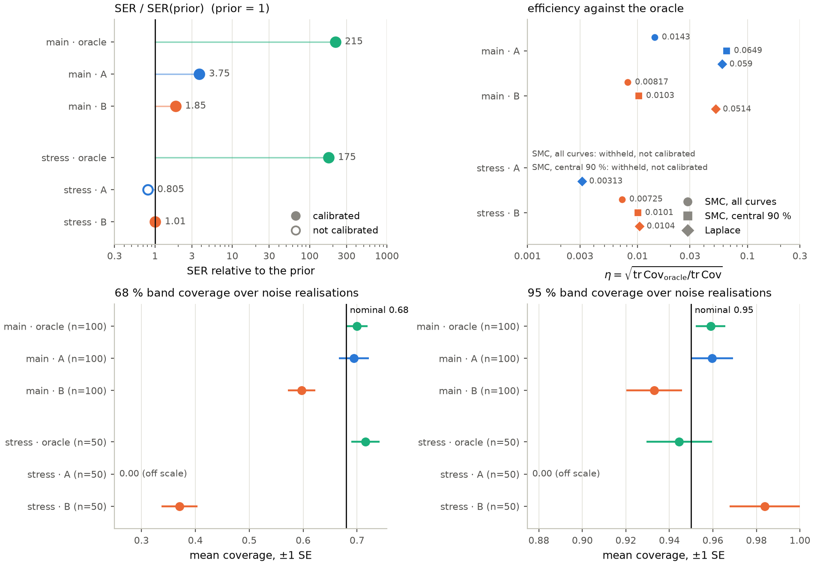
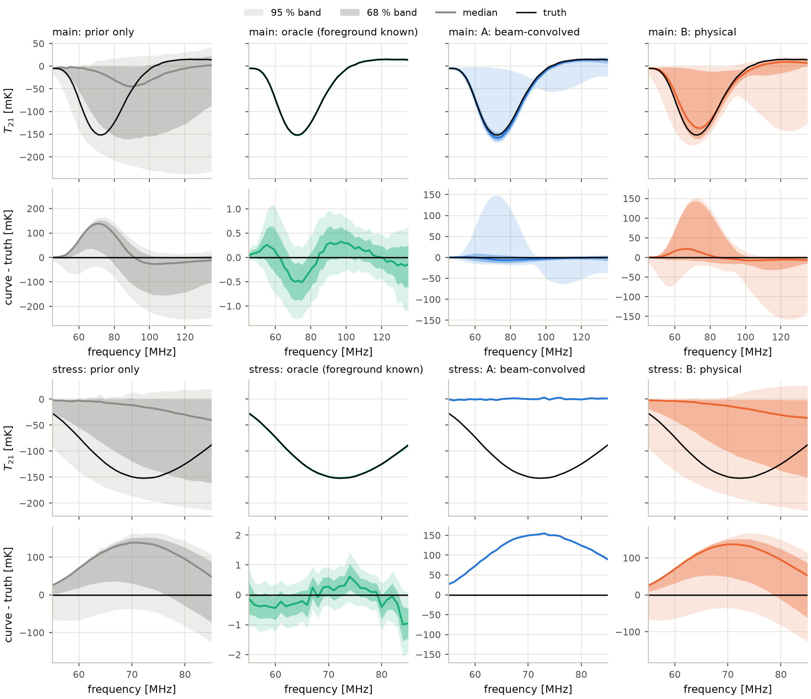
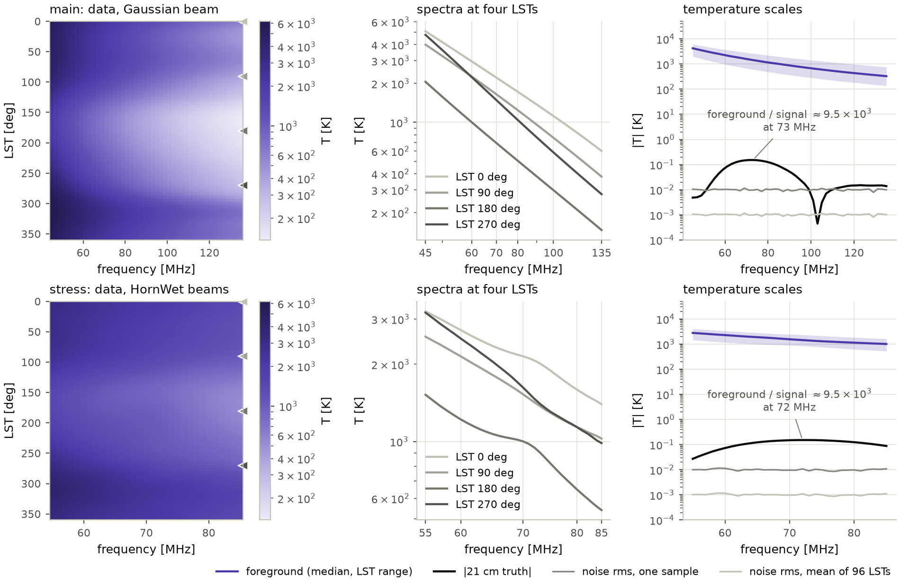
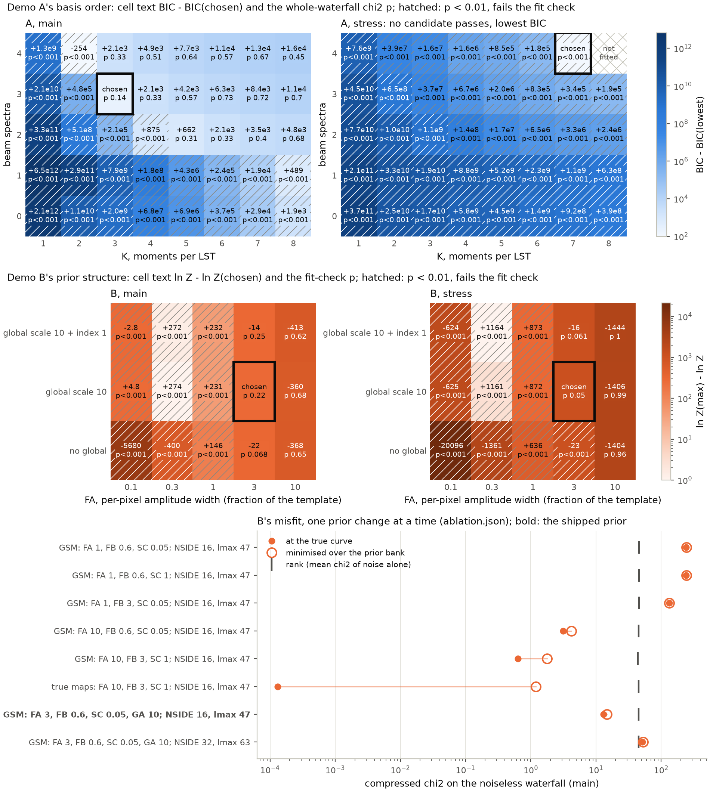
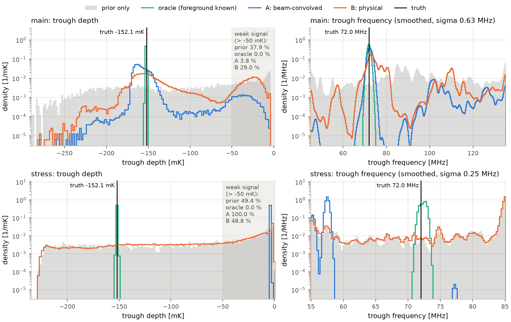
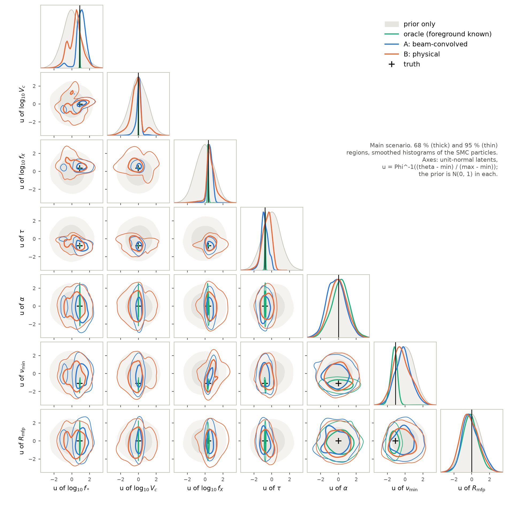
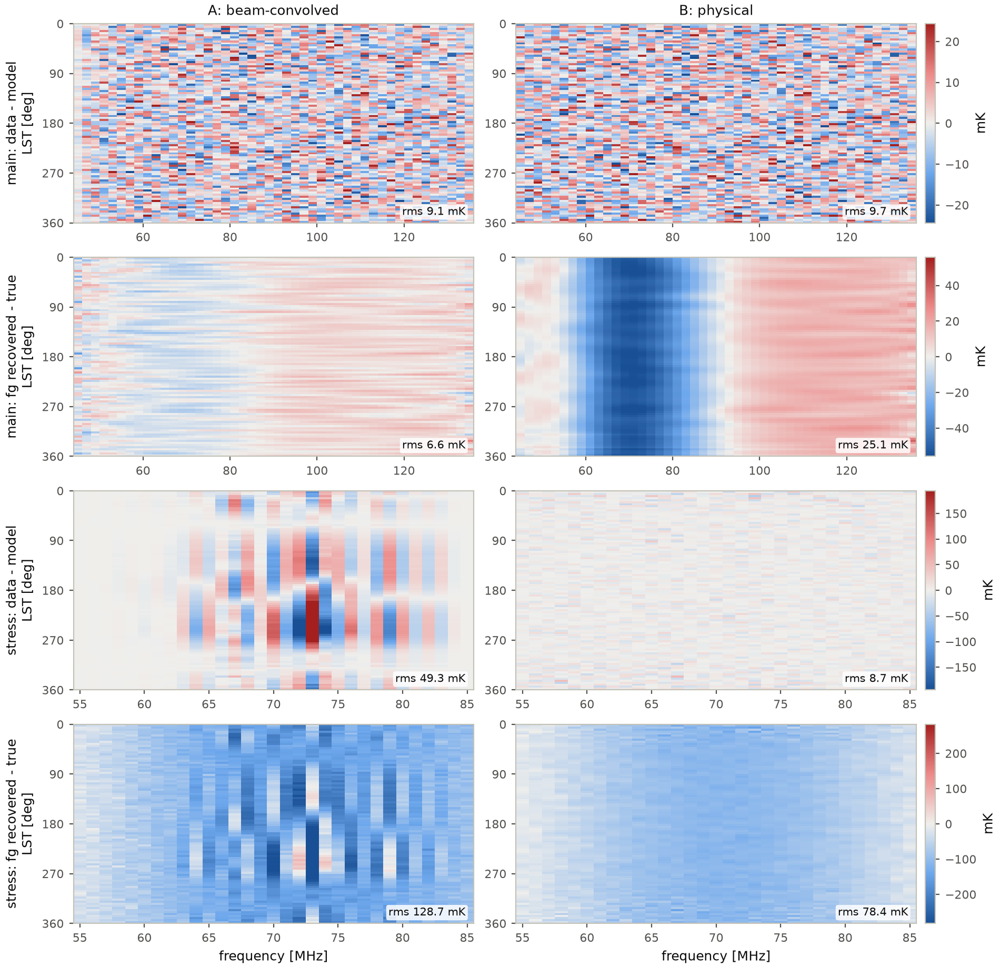
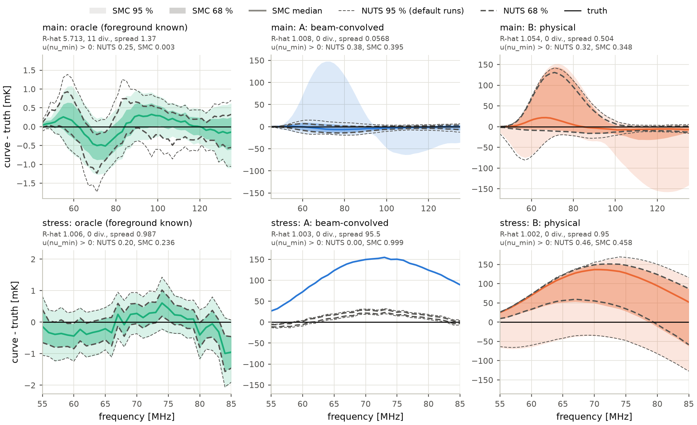
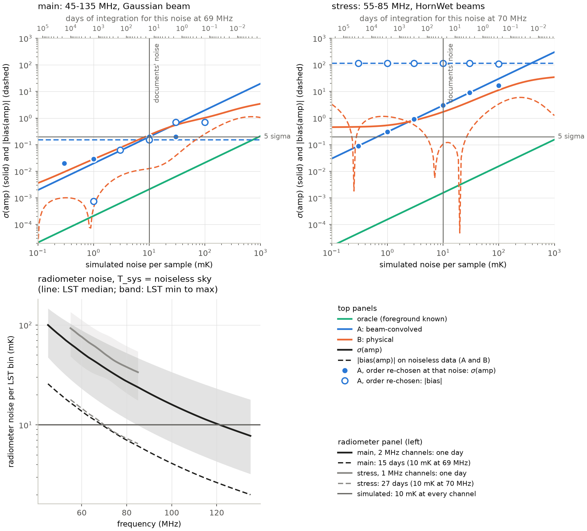

# Global 21 cm separation: two configured strategies on one drift scan

Two foreground strategies are fitted to the same simulated drift-scan
waterfall to recover the 21 cm global signal. Demo A (beam-convolved) gives
every LST its own spectrum on a moment basis. Demo B (physical) fits
low-resolution sky maps with GSM2008-centred priors, projected through the
known beam. An oracle, which subtracts the true foreground, is the
reference. A figure of merit scores each recovered curve against the
injected one, against the prior, and against the data. There are two
scenarios: a main one and a labelled stress case.

Outcome (`results/analysis/fom.json`; each quantity is defined under "The
figure of merit"):

| scenario | posterior | SER / prior | calibrated | sigma(amp) |
|---|---|---|---|---|
| main | oracle | 215 | yes | 0.00211 |
| main | A | 3.75 | yes | 0.197 |
| main | B | 1.85 | yes | 0.231 |
| stress | oracle | 175 | yes | 0.00155 |
| stress | A | 0.805 | no | 3.01 |
| stress | B | 1.01 | yes | 1.71 |

In the main scenario both strategies are calibrated, and A's SER relative
to the prior is about twice B's. In the stress scenario A fails the
goodness-of-fit check and B's posterior stays close to the prior.



`fom_summary.png`, drawn from `fom.json` alone. Top left: SER relative to
the prior on a log axis; a filled marker is a calibrated posterior, an open
one is not. Top right: the efficiency eta of A and B from all SMC curves,
from the central 90 % of curves, and from the Laplace forecast. The SMC eta
is withheld where a posterior is not calibrated (stress A); the Laplace
eta, sampler-free, is drawn for A and B in both scenarios. Bottom: 68 and
95 % band coverage over noise realisations, mean ± one standard error,
against the nominal level.



`signal_recovery.png`. Columns: prior, oracle, A, B; main scenario in the
top two rows, stress in the bottom two. Rows 1 and 3: 68 and 95 % bands and
the median of the curve T21 (mK), from the SMC particles for the oracle, A
and B and from the 4000 prior draws for the prior column; the truth is in
black. Rows 2 and 4: the same bands of curve minus truth, each panel on its
own symmetric axis.

The design plan, `.agents/plans/T-003-global21cm-separation.md`, is
git-ignored. It holds the design decisions and the review record.
Deviation 2 and the route change under "Demo B's numerical route" cite
measurements recorded only there.

## Notation and abbreviations

The 21 cm parameters theta are the seven inputs of the 21cmVAE emulator
(Bye, Portillo & Fialkov 2022), through the JAX port `global21cm_jax`. The
first three are sampled as base-10 logarithms. The prior is uniform over
the emulator's training box (`signal21.prior_box`):

| parameter | meaning | unit | box low | box high | truth |
|---|---|---|---|---|---|
| log10 fstar | star formation efficiency | - | -4 | -0.301 | -1 (fstar 0.1) |
| log10 Vc | minimum virial circular velocity | km/s | 0.6232 | 2 | 1.301 (Vc 20) |
| log10 fx | X-ray efficiency | - | -6 | 3 | -0.301 (fx 0.5) |
| tau | CMB optical depth | - | 0.04002 | 0.1738 | 0.07 |
| alpha | slope of the X-ray spectrum | - | 1 | 1.5 | 1.25 |
| nu_min | low cut-off of the X-ray spectrum | keV | 0.1 | 3 | 0.5 |
| Rmfp | mean free path of ionising photons | Mpc | 10 | 50 | 30 |

| symbol | meaning |
|---|---|
| u | the seven sampled latents, u ~ Normal(0, I); theta = low + (high - low) Phi(u), Phi the standard normal CDF (`signal21.box_from_unit_normal`). The truth is u = (0.882, -0.019, 0.34, -0.758, 0.0, -1.09, 0.0) |
| c(theta) | the emulated curve T21(nu) on the channel grid, K |
| t | the injected curve, c(theta_true) |
| T_s | the curve of posterior draw s, s = 1..N |
| n_time, n_freq | the number of LST bins, 96, and of channels, 46 (main) or 31 (stress) |
| d | the waterfall, n_time LSTs by n_freq channels, vectorised frequency-major; n_data = n_time n_freq |
| a, m, S | the linear foreground coefficients, their prior mean and prior covariance (S infinite for demo A's flat prior) |
| J | the foreground Jacobian: d = J a + T c(theta) + n |
| T | the tiling matrix, n_data by n_freq: the same curve at every LST |
| sigma, sigma0 | white noise per sample; sigma0 = 10 mK, the documents' value |
| C | sigma^2 I + J S J^T, the covariance of d with the foreground integrated out |
| G | T^T C^-1 T, the likelihood's precision on the curve |
| D, y | the compressed design and statistic: y ~ Normal(D c(theta), sigma0^2 I) |
| rank | the number of directions of G the statistic keeps (at most n_freq) |
| n_basis | demo A's basis columns per LST, K max(n_beam, 1) (under "Demo A") |
| P_perp | the projector off a span: demo A's basis at each LST, or the foreground Jacobian's singular directions (under "The a-priori predictor") |
| prior bank | 40000 draws of u from Normal(0, I) (seed 7) and their curves (`strategies.prior_bank`); the chains' start, both fit checks and the prior-only posterior (its first 4000 draws) use it |
| FA, FB, SC, GA, GB | demo B's prior widths (under "Demo B") |

| abbreviation | meaning |
|---|---|
| SER | signal-to-error ratio (under "The figure of merit") |
| GoF | goodness of fit (under "The figure of merit") |
| PIT | probability integral transform |
| SMC | sequential Monte Carlo; here adaptive tempering (`smc.py`) |
| NUTS | the No-U-Turn Sampler of numpyro; the documents' `kind: nuts` runs |
| R-hat | the split Gelman-Rubin potential scale reduction over chains (numpyro's `summary`) |
| ESS | effective sample size (numpyro's `summary`, `n_eff`) |
| CMB | cosmic microwave background |
| FWHM | full width at half maximum |
| MERS | the foreground-model repository github.com/zzhang0123/MERS (under "Running") |
| RHINO | the 21 cm global-signal horn experiment whose site and HornWet beams are used |
| LAMBDA | NASA's Legacy Archive for Microwave Background Data Analysis |
| BIC | Bayesian information criterion, chi^2_min + (number of fitted parameters) ln n_data |
| LST | local sidereal time; 96 bins of 897.5 s over one sidereal day |
| VJP | vector-Jacobian product, one reverse-mode derivative |
| GSM2008 | the Global Sky Model of de Oliveira-Costa et al. 2008 (MNRAS 388, 247), evaluated with `pygdsm` (github.com/telegraphic/pygdsm) |
| CNN index map | a synchrotron spectral-index map at 56 arcmin made with a convolutional neural network, `cnn56arcmin_beta.npy` in MERS's data directory; not public (from Melis Irfan, per MERS's `data/README.md`) |
| HEALPix NSIDE | the HEALPix resolution: 12 NSIDE^2 pixels; an NSIDE 16 pixel is 3.66 deg across |
| lmax | the band-limit of a spherical-harmonic expansion |

## The scenarios

`simulate.py` writes one waterfall per scenario, to `results/sim/` (main)
and `results/sim_stress/`:

| | main | stress |
|---|---|---|
| band | 45-135 MHz, 46 channels of 2 MHz | 55-85 MHz, 31 channels of 1 MHz |
| beam | analytic Gaussian, FWHM 30 deg at 70 MHz, scaling as 1/nu | RHINO `HornWet` horn beams, one per channel |
| foreground range | 137-6211 K | 527-4041 K |
| trough on the channel grid | -151.8 mK at 73 MHz | -152.1 mK at 72 MHz |

`scenario.py` records the reason for each band: the main band is wide
enough that the absorption trough is not a smooth piece of the
foreground's spectral span; in the stress band the HornWet beam's
chromaticity makes the signal and the foreground nearly degenerate.

Common to both:

| | |
|---|---|
| site, pointing | RHINO, latitude 53.2 deg, zenith drift scan, 96 LSTs over one sidereal turn |
| foreground truth | MERS synchrotron (`fg_model.SynchrotronExtrapolator`): Haslam 408 MHz, CNN spectral-index map, curvature -0.10, rotated to equatorial, NSIDE 64 |
| projection | limtod_jax m-mode drift scan (`DriftScanMmode`), lmax 159, beam normalised to K |
| 21 cm truth | 21cmVAE, (fstar, Vc, fx, tau, alpha, nu_min, Rmfp) = (0.1, 20, 0.5, 0.07, 1.25, 0.5, 30); trough -152.07 mK at 72.00 MHz on a 0.25 MHz grid |
| noise | white, homoscedastic, 10 mK per sample, seed 20260923 |

**Band-limit convergence** (`truth.json`, "convergence"): the rms change of
the truth when the same NSIDE 64 maps are projected at another lmax, in mK:

| projected at | main | stress |
|---|---|---|
| lmax 127 instead of 159 | 1.10 | 3.07 |
| lmax 191 instead of 159 | 15.8 | 9.5 |

The multipoles at the HEALPix band edge (lmax 191 = 3 NSIDE - 1) are the
poorly sampled ones, so the truth uses lmax 159.

**The noise as an integration** (`sensitivity.json`, "radiometer"). The
system temperature is taken to be the noiseless sky waterfall itself, and
the receiver temperature is neglected. One LST bin collects t_bin = 897.5 s
per sidereal day, so one day's noise is T_sys / sqrt(dnu t_bin), and 10 mK is
reached after (sigma_1day / 10 mK)^2 days:

| scenario | reference channel | channel width | one day, LST median | days for 10 mK, LST median (range over LST) | days across the band, LST medians | noise max / min across the band (LST medians) | noise max / min over LST at the reference channel |
|---|---|---|---|---|---|---|---|
| main | 69 MHz | 2 MHz | 38.8 mK | 15.0 (2.7-47.5) | 0.60 at 135 MHz to 99.9 at 45 MHz | 12.87 | 4.21 |
| stress | 70 MHz | 1 MHz | 51.9 mK | 26.9 (8.8-66.4) | 11.3 at 85 MHz to 86.3 at 55 MHz | 2.76 | 2.74 |

The simulated noise is the same at every sample; a radiometer's follows the
sky.



`scenario_overview.png`. One row per scenario. Left: the data waterfall in K
on a log colour scale shared by both rows, LST running down; the triangles
mark the four LSTs of the middle panel. Middle: the spectra at LST 0, 90,
180 and 270 deg, light to mid grey.
Right: the median foreground over LST (band: its range over LST), the
absolute 21 cm truth, and the noise rms of one sample and of the mean of 96
LSTs, on one log axis. At the trough the foreground is about 9.5e3 times
the signal in both scenarios.

## How each document carries its strategy

Each document names its foreground strategy in
`resources.arrays.foreground`. The entry is a `python:` hook in
`strategies.py`, with the data it reads as `file:` arguments (hashed into
the run tree's `provenance.json`) and its choices as `literal:`:

| document | hook | literal |
|---|---|---|
| `oracle.yaml` | `known_foreground`: the true foreground subtracted | none |
| `beamconv.yaml` | `per_lst_moments` (demo A) | `order: bic_among_passing`, `moments: [1, 8]`, `beam_terms: [0, 4]`, `beta0: -2.55`, `nu_ref_mhz: 70.0` |
| `physical.yaml` | `gaussian_sky` (demo B) | `nside: 16`, `lmax: 47`, `template: gsm2008`, `amplitude_frac: 3.0`, `index_sigma: 0.6`, `curvature_sigma: 0.05`, `global_amplitude_sigma: 10.0`, `global_index_sigma: 0.0`, `relinearise: 3` |

### The marginalisation and the compressed statistic

Each strategy is linear in its foreground coefficients, with a flat (A) or
Gaussian (B) prior, and the 21 cm curve is the same at every LST. The hook
therefore integrates the foreground out analytically (`collapse.py`):

    d = J a + T c(theta) + n,          n ~ Normal(0, sigma^2 I),   a ~ Normal(m, S)
    d ~ Normal(J m + T c(theta), C),   C = sigma^2 I + J S J^T

Up to a constant in theta, log L(theta) = b^T c - c^T G c / 2, with
G = T^T C^-1 T and b = T^T C^-1 (d - J m). With G = V diag(g) V^T, the
directions with g below 1e-12 of the largest are dropped, and

    y = sigma0 g^-1/2 V^T b,   D = sigma0 g^1/2 V^T,   y ~ Normal(D c(theta), sigma0^2 I)

is one Gaussian statistic of at most n_freq numbers, zero-padded to n_freq
so it fits the channel grid. For demo A's flat prior, C^-1 becomes the
per-LST projector off the basis and G = n_time P_perp / sigma^2. For the
oracle, C = sigma^2 I and J m is the true foreground.

Three entries of each document use the hook's output:

* `resources.arrays.design` passes D to the 21 cm operator
  (`signal21.CompressedSignal`). It refuses unless the document's
  `inference.observed` file is this strategy's statistic of this waterfall
  (`strategies.design_checked`).
* `inference.observed` names the file `prepare.py` writes by calling the
  same hook with the same arguments, read from the document.
* `resources.arrays.start` starts the chains at the prior draw of highest
  posterior among 40000: log p = -chi^2(y; D c)/2 - |u|^2/2
  (`strategies.start_point`). The posterior is multimodal, and chains
  started at the box centre were measured to settle in a mode 270 log-units
  below the truth's on the main oracle (the function's docstring).

The seven latents u are the only parameters of each document. Each
document has one variant, `stress`, which moves every file argument to
`results/sim_stress/`; both scenarios run from one file.

`tests/test_collapse.py` checks the compressed likelihood against the dense
marginal likelihood (equal up to one constant), the marginal chi^2 against
the dense Mahalanobis distance, and demo B's square root (under "Demo B's
numerical route") against a 50-digit reference.

### Demo A, beam-convolved

Every LST's spectrum is free on a fixed basis: MERS's moment expansion
(`SEDfitting.fg_moment_basis`),

    phi_k(nu) = (nu / nu_ref)^beta0 [ln(nu / nu_ref)]^k,   k = 0 .. K-1,

multiplied column by column by the leading beam-SVD spectra (the left
singular vectors of the pixel-sum-normalised beam maps, MERS's `BCSVD`
route), each column scaled to unit norm and the whole basis
orthonormalised. A basis with K moments and n_beam spectra has
K max(n_beam, 1) columns. The coefficients have a flat prior and are
integrated out.

One pair beta0 = -2.55, nu_ref = 70 MHz serves every LST
(`scenario.BETA0_MOMENT`, `NU_REF_MOMENT_MHZ`). Neither the code nor the
plan records a reason for these values. For comparison, the truth's local
spectral index d ln T / d ln nu at 70 MHz has median -2.24 over the NSIDE 16
pixels (from `results/sim/beta_fit.npy` as beta + c [ln(nu / nu_c) +
ln(nu / 408 MHz)], with MERS's c = -0.10 and nu_c = 11704 MHz; not recorded
in a product).

**The order rule.** The candidates are K = 1..8 moments by 0..4 beam
spectra; bases wider than n_freq - 3 columns are skipped, which leaves 40
candidates in main and 39 in stress (in stress, K = 8 with 4 beam spectra
would need 32 columns, above the 28 allowed on 31 channels). For each
candidate (`strategies.model_order`):

* chi^2_min is the whole waterfall's chi^2, with the per-LST coefficients
  fitted, minimised over the 40000-draw prior bank of curves;
* its p-value is taken on n_data - n_time n_basis - 7 degrees of freedom,
  and the candidate passes the fit check when p >= `strategies.FIT_CHECK_P`
  = 0.01, the threshold demo B's prior selection also uses;
* BIC = chi^2_min + (n_time n_basis + 7) ln n_data, so each basis column
  costs 96 ln 4416 = 805.7 (main).

The documents' rule, `order: bic_among_passing`, takes the lowest BIC among
the passing candidates, or the lowest BIC overall when none passes
(recorded as `passes: false`). The rule `order: bic`, the lowest BIC
overall, remains in `strategies.ORDER_RULES`; no document uses it.

A minimum over a finite bank is at least the continuous minimum, so the
check errs toward failing. In main the chosen candidate has the lowest p
among the passing candidates, and K = 2 with 4 beam spectra the highest p
among the failing ones (`prepare.json`, `model_order`).

| scenario | candidates | passing | chosen | columns | chi^2 (dof) | p | chi^2 / datum | BIC | lowest BIC overall |
|---|---|---|---|---|---|---|---|---|---|
| main | 40 | 16 | K = 3, 3 beam spectra | 9 | 3634.4 (3545) | 0.144 | 0.82 | 10944.7 | K = 2, 4 beam spectra: 10691.1, p 5.1e-10 |
| stress | 39 | 0 | K = 7, 4 beam spectra (fallback) | 28 | 72420.5 (281) | 0 | 24.3 | 93976.0 | the same |

In main the fit check excludes K = 2 with 4 beam spectra, whose BIC is
253.6 below the chosen candidate's (table). The next passing candidates
after the chosen one are K = 5 with 2 beam spectra (BIC +662) and K = 3
with 4 (+2075). In stress no candidate passes, so the rule takes the lowest
BIC, which is the widest basis the grid allows, 28 columns on 31 channels;
its statistic has rank 3.

The grid is drawn in `model_selection.png`, at the end of "Demo B,
physical".

### Demo B, physical

The fitted sky has four parts, all through the MERS law and projected by the
limtod_jax drift scan at NSIDE 16 and lmax 47 with the known beam:

* an amplitude map A at 70 MHz (3072 pixels);
* a free global scale g_s of the template, A += g_s a_g;
* a first-order spectral-index map, B = A_t (beta - beta_t), where A_t and
  beta_t are the amplitude and index maps at the linearisation point (under
  "Linearisation");
* one global curvature column, kappa.

The response matrix is built by reverse mode, one VJP per LST sample
(`instrument.drift_response`). The plan suggested NSIDE 4-8; no reason for
16 is recorded.

**The template** is GSM2008 at 45, 70, 135 and 408 MHz, with the CMB
(2.725 K) removed, rotated to equatorial and averaged to NSIDE 16
(`physical_inputs.gsm_template`). It is independent of the truth. Per pixel,
the index beta_g and a curvature are solved from the 45, 135 and 408 MHz
maps; a_g is the 70 MHz map, and kappa_g = -0.102 is the median curvature.

**The priors**, with FA the per-pixel amplitude width as a fraction of the
template:

    A ~ Normal(a_g, (FA a_g)^2) per pixel,   g_s ~ Normal(0, GA^2)
    beta ~ Normal(beta_g, FB^2) per pixel     (plus a global offset of width GB when GB > 0)
    kappa ~ Normal(kappa_g, SC^2)

with FA = 3, FB = 0.6, SC = 0.05, GA = 10 and GB = 0 (no global index offset)
in both documents. The index prior enters the fit through B:

    B ~ Normal(A_t (beta_g - beta_t), (FB A_t)^2) per pixel

**The template against the truth** (`ablation.json`, NSIDE 16):

| quantity | key | median | 16 % | 84 % | median of the absolute value |
|---|---|---|---|---|---|
| 70 MHz amplitude, GSM / truth | `gsm_amplitude_over_truth` | 1.78 | 1.41 | 2.23 | - |
| spectral index, beta_GSM - beta_true | `gsm_index_minus_truth` | -0.216 | -0.394 | -0.062 | 0.221 |

**Linearisation.** The point (A_t, beta_t, kappa_t) starts at the GSM values
and is moved three times to the posterior mean of the fit with no 21 cm
signal (Gauss-Newton). The prior centres of A, beta and kappa stay on GSM;
B's prior moves with the point. The point comes from the data, which makes
the prior empirical Bayes. The median |d beta| of the three steps is
0.0094, 0.0052 and 0.0009 in main, and 0.041, 0.031 and 0.011 in stress;
the final kappa_t is -0.1122 and -0.1132 (`prepare.json`, "linearisation",
key `c_t`).

**The ablation.** `ablation.py` fits demo B's model to the main scenario's
noiseless waterfall under each prior in the table and reports the
compressed chi^2 at the true curve: with no noise, pure misfit in the
directions the signal can move (`results/analysis/ablation.json`, keys
`<row>@<NSIDE>/<lmax>`):

| key | prior | chi^2 at the true curve | chi^2 minimised over the prior bank | rank |
|---|---|---|---|---|
| `gsm_1.0_0.6_0.05@16/47` | GSM template, FA 1, FB 0.6, SC 0.05, no global columns | 242.7 | 244.6 | 46 |
| `gsm_curvature_1@16/47` | the same, SC widened to 1 | 242.0 | 243.9 | 46 |
| `gsm_index_3@16/47` | the same, FB widened to 3 | 132.7 | 133.5 | 46 |
| `gsm_amplitude_10@16/47` | the same, FA widened to 10 | 3.13 | 4.22 | 45 |
| `gsm_all_wide@16/47` | all three widened (FA 10, FB 3, SC 1) | 0.64 | 1.77 | 44 |
| `truth_template_wide@16/47` | the true NSIDE 16 maps as template, all widened, no relinearisation | 0.00013 | 1.19 | 45 |
| `chosen@16/47` | the shipped prior (FA 3, FB 0.6, SC 0.05, GA 10) | 13.1 | 14.7 | 45 |
| `chosen@32/63` | the shipped prior at NSIDE 32 / lmax 63 | 51.5 | 53.2 | 45 |

The bank's minimum exceeds chi^2 at the true curve on every row, because
the 40000-draw bank does not contain the true curve.

The amplitude width carries almost all of the misfit, and the true maps as
template leave 0.00013. GSM's 70 MHz amplitude exceeds the truth's in at
least 84 % of the pixels (the ratio's 16 % point in the template table is
above 1), so independent per-pixel priors around GSM make a tight, wrong
prior on the beam-averaged sky; a free global scale releases it.
Pixelisation and lmax 47
together cost 0.00013 in chi^2 because the beam (FWHM 15.6 deg at 135 MHz,
46.7 deg at 45 MHz) is much wider than an NSIDE 16 pixel (3.66 deg). Under
the shipped prior, NSIDE 32 / lmax 63 gives chi^2 51.5 against 13.1 at
NSIDE 16.

**Prior-structure selection.** `prepare.py` evaluates the declared grid
`physical_inputs.PRIOR_GRID`: FA in {0.1, 0.3, 1, 3, 10}, each with no
global columns, with the global scale (GA 10), or with the global scale and
a global index offset (GA 10, GB 1). For each structure it records:

* ln Z_fg, the type-II log evidence of the waterfall with no 21 cm signal,
  log Normal(d; J m, C) (`physical_inputs.log_evidence`);
* the fit check: the compressed chi^2 minimised over the 40000-draw prior
  bank, against rank - 7 degrees of freedom (`strategies.bank_fit`). It is
  truth-free and sampler-free.

The rule is the highest ln Z_fg among the structures whose fit check reaches
p >= 0.01 (`prepare.best_structure`). `prepare.json` records the grid, the
rule's choice, and `document_is_best: true` when the document's literal is
that choice:

| global columns | FA | main ln Z_fg | main fit chi^2 (dof) | main p | stress ln Z_fg | stress fit chi^2 (dof) | stress p |
|---|---|---|---|---|---|---|---|
| none | 0.1 | 6759.2 | 11814.9 (39) | 0 | -14439.4 | 41929.4 (24) | 0 |
| none | 0.3 | 12038.9 | 1655.7 (39) | 0 | 4295.1 | 5581.6 (24) | 0 |
| none | 1 | 12585.1 | 273.6 (39) | 5.3e-37 | 6292.6 | 627.7 (24) | 3.7e-117 |
| none | 3 | 12417.3 | 51.7 (38) | 0.068 | 5633.6 | 71.5 (23) | 7e-7 |
| none | 10 | 12071.2 | 34.0 (38) | 0.65 | 4252.0 | 12.4 (23) | 0.96 |
| scale | 0.1 | 12444.0 | 866.9 (39) | 1.3e-156 | 5031.5 | 3944.8 (24) | 0 |
| scale | 0.3 | 12713.0 | 371.4 (39) | 8.4e-56 | 6817.5 | 679.9 (24) | 4.2e-128 |
| scale | 1 | 12670.0 | 106.8 (38) | 1.8e-8 | 6528.4 | 159.1 (24) | 6.6e-22 |
| scale | 3 | 12439.2 | 44.3 (38) | 0.22, chosen | 5656.3 | 35.2 (23) | 0.050, chosen |
| scale | 10 | 12079.3 | 33.5 (38) | 0.68 | 4250.7 | 9.7 (23) | 0.99 |
| scale + index | 0.1 | 12436.4 | 869.5 (39) | 3.7e-157 | 5032.4 | 3937.9 (24) | 0 |
| scale + index | 0.3 | 12711.5 | 375.2 (39) | 1.5e-56 | 6820.3 | 669.8 (24) | 5.5e-126 |
| scale + index | 1 | 12671.3 | 104.0 (38) | 4.8e-8 | 6529.8 | 155.3 (24) | 3.4e-21 |
| scale + index | 3 | 12425.2 | 43.5 (38) | 0.25 | 5640.1 | 34.3 (23) | 0.061 |
| scale + index | 10 | 12026.3 | 33.8 (37) | 0.62 | 4212.5 | 7.8 (23) | 1 |

The evidence alone peaks at FA 0.3 in both scenarios (main: with the global
scale; stress: with the global scale and the index offset), and both peaks
fail the fit check. ln Z_fg is a density over all 4416 (main) waterfall
samples, while the fit check looks at the statistic of rank 46 or less that
the signal can move. The rule picks FA 3 with the global scale in both
scenarios, 274 (main) and 1164 (stress) below the peak in ln Z_fg; FA 3 is
the narrowest per-pixel width that passes.



`model_selection.png`. Top: demo A's order grid, one panel per scenario;
cell text is BIC minus the chosen cell's BIC and the whole-waterfall p;
the colour is BIC minus the lowest BIC in the grid; hatched cells fail the
fit check; the chosen cell is boxed. The -254 in main is K = 2 with 4 beam
spectra, which has the lowest BIC and fails. Middle: demo B's 15-cell prior
grid; cell text is ln Z_fg minus the chosen cell's and the fit-check p; the
colour is ln Z_fg below the grid's highest; hatched cells fail. In both
grids a darker cell is a worse candidate. Bottom: the ablation rows above,
with chi^2 at the true curve (filled), chi^2 minimised over the prior bank
(open) and the rank (tick, the mean chi^2 of noise alone); the shipped
document's prior, at NSIDE 16 and lmax 47, is in bold.

### Demo B's numerical route

Demo B's Jacobian is 4416 by 6146 in the main scenario (the amplitude and
index maps of 3072 pixels each, the global scale and the curvature column).
At the linearisation point the earlier Gram-matrix route produced
(2026-09-23; the plan's review record, round 1), J S J^T had largest
eigenvalue 3.3e12 K^2 in main, against sigma^2 = 1e-4 K^2. Forming that
Gram matrix in float64 perturbs C by about eps x 3.3e12 = 7e-4 K^2, seven
times the noise term.

`collapse.GaussianMarginal` never forms it. With W = J S^1/2:

* one Householder QR of W^T gives an upper-triangular R0 with
  R0^T R0 = W W^T, independent of the noise;
* for a noise level sigma, a QR of the stacked triangles [R0; sigma I]
  (LAPACK `tpqrt`) gives R with R^T R = C.

Then C^-1 x = R^-1 R^-T x, x^T C^-1 x = ||R^-T x||^2,
log det C = 2 sum_i log|R_ii|, and the foreground's posterior mean is
m + S J^T C^-1 (d - J m). Both QRs are backward stable in W, so the
relative error is about eps ||W|| / sigma (4e-8 at 10 mK); through the Gram
matrix it is eps ||W||^2 / sigma^2 (7 at 10 mK). The hook, the
relinearisation, the type-II evidence, `prepare.py`'s prior grid,
`ablation.py` and `sensitivity.py` all use this one helper.

The table gives relative differences on the real problem. The first two
rows were measured on 2026-09-23 at the linearisation point the earlier
Gram-matrix route produced, against an SVD (`gesdd`) and a pivoted-QR
least-squares solve (`gelsy`). The third is
`sensitivity.json`, "shuffled_columns_at_sigma0", over 5 random column
orders of the Jacobian.

| quantity | main | stress |
|---|---|---|
| sigma(amp), G and b: largest difference from `gesdd` or `gelsy` | 1.4e-9 | 2.4e-8 |
| the evidence's quadratic form, against `gelsy` | 4.2e-12 | 5.0e-12 |
| sigma(amp) over the column orders | 4.6e-11 | 1.9e-10 |

Until the change of 2026-09-23 the hook formed J S J^T. With the emulator
at f328e83, replacing that route moved demo B's sigma(amp) from 0.2327 to
0.2309 (main) and from 1.715 to 1.708 (stress); the plan's review record
(round 2) holds these numbers. `prepare.py` factorises 64 linear models per
scenario: the document's structure and the 15 of the grid, each at 4
linearisation points. Each needs a QR of the 6146 by 4416 matrix W^T;
`prepare`'s time is in the table under "Running".

## Running

From the repository root.

**Dependencies.** The repository's `.venv`, built as the repository
README's "Install" section describes, holds rheplicant, bayesmith 0.10.0 (a
local wheel), jax 0.11.0, limtod_jax 1.10.0 with s2fft, and healpy. The
example needs in addition:

| dependency | used by | source |
|---|---|---|
| numpyro 0.21 | the documents' `kind: nuts` runs | the `dev` dependency group or the `numpyro` extra of `pyproject.toml` |
| `global21cm_jax` (distribution `global21cm-jax` 0.1.0, from the 21cmVAE-jax repository) | the 21 cm curve, in every step | https://github.com/RHINO-Experiment/21cmVAE-jax, public (`main` at 7a1b455 on 2026-09-25, `git ls-remote`). The products were made at 7a1b455 in one run (2026-09-24); the package's source hash was the same at the start and the end of that run. 21cmVAE-jax's commit 5ceee47 regenerated the emulator's normalisation constants to match upstream 21cmVAE's constants bitwise, which moves the emulator output by at most 4.6e-5 mK (the commit message). The example's 259 tests pass against 7a1b455 (2026-09-24). Install editable from a clone: `uv pip install --python .venv/bin/python --no-deps -e <21cmVAE-jax checkout>`. The emulator weights ship in the package; nothing downloads |
| `pygdsm` (1.7.1 here) | demo B's GSM2008 template: `prepare`, `ablation`, `sensitivity`, `rheplicant validate` and `rheplicant run` of `physical.yaml` and `physical_quick.yaml` (the hook `strategies.gaussian_sky`), `tests/test_document_likelihood.py` | `uv pip install --python .venv/bin/python pygdsm`. The first use downloads `gsm_components.h5` (81,777,450 bytes) from apps.datacentral.org.au into `~/.astropy/cache`, so the first `prepare main` needs network access |
| matplotlib (3.11.2 here) | every figure: `analyse`, `plots`, `sensitivity`; `tests/test_analyse.py` and `tests/test_figures.py` import it | a requirement of `pygdsm` |
| MERS | `simulate` (the truth's synchrotron maps); `tests/test_ports.py` | https://github.com/zzhang0123/MERS, public. Its `MERS/data/` must hold `haslam408_dsds_Remazeilles2014.fits` (public, from LAMBDA) and `cnn56arcmin_beta.npy` (not public) |
| RHINO HornWet beams | `simulate stress` | RHINO horn simulations, not redistributable. One HEALPix file per 0.5 MHz, `HornWet55.0.fits` to `HornWet85.0.fits` (61 files); the stress band reads the 31 integer-MHz ones |

Outside this machine, `simulate` cannot run: `cnn56arcmin_beta.npy` is not
public and the HornWet files are not redistributable. `results/sim*/`, the
run trees and `posteriors.npz` are not kept in git, so no later step of the
pipeline can run either. A fresh checkout can read the kept
`results/analysis*/` products and run the tests; the test table below gives
the counts without `results/sim*/`, and `tests/test_ports.py` needs a MERS
checkout.

**Environment.**

```bash
export MERS_DATA_DIR=<MERS checkout>/MERS/data   # simulate: the Haslam and CNN index maps
export HORNWET_DIR=<directory of HornWet55.0.fits ... HornWet85.0.fits>   # simulate stress only
export PYTHONPATH=examples                        # the plugin and the hooks live in examples/global21cm
```

`PYTHONPATH` is needed by every pipeline command, the `rheplicant` CLI
included, because the documents' `plugins:` and `python:` entries import
`global21cm`. `MERS_DATA_DIR` and `HORNWET_DIR` are read by `simulate.py`
alone, which refuses a missing directory or file (Deviation 4).

**The full pipeline**, in this order (`ablation` writes the file the
figures of `analyse` read):

```bash
.venv/bin/python -m global21cm.simulate main
.venv/bin/python -m global21cm.simulate stress
.venv/bin/python -m global21cm.prepare main
.venv/bin/python -m global21cm.prepare stress
.venv/bin/python -m global21cm.ablation
.venv/bin/rheplicant run examples/global21cm/oracle.yaml
.venv/bin/rheplicant run examples/global21cm/beamconv.yaml
.venv/bin/rheplicant run examples/global21cm/physical.yaml
.venv/bin/python -m global21cm.analyse
.venv/bin/python -m global21cm.sensitivity
.venv/bin/python -m global21cm.plots        # optional: redraws the eight analyse figures without SMC
```

**The quick path.** The `*_quick.yaml` documents run 300 + 300 NUTS steps
per chain instead of 1000 + 1000. They differ from the full ones only in
each run's `num_warmup` and `num_samples` and in `outputs.dir`
(`tests/test_documents.py` holds every other section equal). `analyse
--quick` scores them into `results/analysis_quick/`; `sensitivity` has no
quick form.

```bash
.venv/bin/python -m global21cm.simulate main
.venv/bin/python -m global21cm.simulate stress
.venv/bin/python -m global21cm.prepare main
.venv/bin/python -m global21cm.prepare stress
.venv/bin/python -m global21cm.ablation
.venv/bin/rheplicant run examples/global21cm/oracle_quick.yaml
.venv/bin/rheplicant run examples/global21cm/beamconv_quick.yaml
.venv/bin/rheplicant run examples/global21cm/physical_quick.yaml
.venv/bin/python -m global21cm.analyse --quick
.venv/bin/python -m global21cm.plots --quick   # optional
```

`analyse` hashes every file that the run trees' `provenance.json` and
`prepare.json` record, and refuses if one has changed. `plots` refuses when
a simulation file that `fom.json` hashed has changed, or when the saved
particles do not reproduce `fom.json`'s trough-depth quantiles to 1e-12.

`rheplicant validate examples/global21cm/<document>.yaml` resolves the
documents' `file:` arguments, so it exits 2 until `simulate` and `prepare`
have written `results/sim*/`.

**Measured times.** One machine: 28 cores, 96 GB, macOS. Every step of
both paths except the optional `plots` ran once, in one sequence on
2026-09-24: `simulate`, `prepare`, the six documents, `ablation`,
`sensitivity`, `analyse`, `analyse --quick`. The machine was not idle:
other jobs ran. Each time is a wall time, with the 1-minute load average
read at the step's start and at its end.

| command | wall time, s | 1-minute load at start / end |
|---|---|---|
| `simulate main` | 262 | 10.1 / 11.7 |
| `simulate stress` | 233 | 11.7 / 7.5 |
| `prepare main` | 164 | 7.5 / 5.4 |
| `prepare stress` | 87 | 5.4 / 10.5 |
| `ablation` | 142 | 16.7 / 12.7 |
| `run oracle.yaml` | 801 | 10.5 / 5.4 |
| `run beamconv.yaml` | 172 | 9.5 / 17.0 |
| `run physical.yaml` | 203 | 15.4 / 15.9 |
| `run oracle_quick.yaml` | 229 | 5.4 / 9.5 |
| `run beamconv_quick.yaml` | 80 | 17.0 / 15.4 |
| `run physical_quick.yaml` | 92 | 15.9 / 16.7 |
| `analyse` | 805 | 9.8 / 21.3 |
| `analyse --quick` | 803 | 21.3 / 33.1 |
| `sensitivity` | 299 | 12.7 / 9.8 |
| `plots`, `plots --quick` | 13.4, 13.7 (2026-09-23; not re-measured) | not recorded |
| `rheplicant validate` | 5 (oracle), 12 (beamconv), 28 (physical); quick files 5, 12 and 29 (2026-09-23; not re-measured) | start / end not recorded; each command's mean 14.7-17.5 |

Each document's time covers both scenarios, 4 chains each. Of `analyse`'s
time, the SMC coverage over noise realisations takes 582 s and the headline
SMC 206 s (`fom.json`, "seconds"); `analyse --quick` runs the same SMC.
Summed over the table, leaving out `plots` and `rheplicant validate`:

| path | seconds | minutes |
|---|---|---|
| full pipeline | 3168 | 53 |
| full pipeline without `sensitivity` | 2869 | 48 |
| quick path | 2092 | 35 |
| quick path, simulation already written | 1597 | 27 |

**Tests** (not collected by the repository's suite, whose `testpaths` is
`tests`):

```bash
MERS_DIR=<MERS checkout> .venv/bin/python -m pytest examples/global21cm/tests -n 2
```

`MERS_DIR` may name the checkout or its inner `MERS/` directory. No other
environment variable is needed. `tests/test_document_likelihood.py` builds
demo B's documents, which evaluates the GSM2008 template, so it needs
`pygdsm` and its data file. Measured on 2026-09-24/25 against the 7a1b455
emulator (counts from `--junit-xml`, pytest's own exit code 0 each time;
times from pytest's summary line):

| environment | tests | passed | skipped | time |
|---|---|---|---|---|
| `MERS_DIR` set, `results/sim*/` present | 259 | 259 | 0 | 161.4 s |
| `MERS_DIR` unset | 241 | 240 | 1: `tests/test_ports.py`'s collection skip, standing for its 19 tests | 132.8 s |
| `MERS_DIR` set, no `results/sim*/` (a fresh checkout) | 259 | 253 | 6: `tests/test_document_likelihood.py`, "run simulate.py and prepare.py first" | 16.0 s |

The tests execute 79.62 % of the package's 2144 statements (pytest-cov over
`examples/global21cm/tests` with `MERS_DIR` set, 2026-09-25; test files
excluded). The modules below 90 %, with the functions the tests do not
execute:

| module | statements | executed | not executed |
|---|---|---|---|
| `prepare.py` | 87 | 27.59 % | `_merge`, `document_spec`, `prior_selection`, `_summary`, `main` |
| `simulate.py` | 54 | 44.44 % | `foreground`, `convergence`, `main` |
| `sensitivity.py` | 245 | 48.16 % | `beamconv_perp`, `physical_perp`, `physical_model`, `checked`, `scenario_record`, `figure` and its helpers, `main` |
| `ablation.py` | 55 | 56.36 % | `main` |
| `analyse.py` | 102 | 57.84 % | `_truth`, `_draws`, `_smc`, `_compare`, `score_model`, `posterior_record`, `main` |
| `plots.py` | 196 | 59.18 % | `derive` and its helpers, the figure-input builders other than `selection_inputs` (whose shipped-row branch is also not executed), `native_spacing`, `render`, `main` |
| `instrument.py` | 50 | 70.00 % | `hornwet_beam_maps`, `beam_maps` |
| `foreground_physical.py` | 31 | 74.19 % | `load_mers_maps` |
| `scoring.py` | 77 | 76.62 % | `realisations` (a 4000-particle SMC per realisation) |
| `scenario.py` | 65 | 80.00 % | `mers_data_dir` and `hornwet_dir`, the data-path refusals |
| `foreground_beamconv.py` | 39 | 84.62 % | `beam_svd_spectra`; the two refusals in `MomentForeground.__call__` |

The other modules execute 95 % of their statements or more.

**The `results/` layout.**

| path | written by | kept in git | holds |
|---|---|---|---|
| `results/sim/`, `results/sim_stress/` | `simulate`, `prepare` | no | the waterfall, noiseless waterfall, true foreground, true curve, channels, beam-SVD spectra, the fit's beam alms and the NSIDE 16 truth maps (`.npy`); `truth.json`; each document's `<model>_data.npy` and `<model>_collapsed.npz`; `prepare.json` |
| `results/{oracle,beamconv,physical}{,_quick}/` | `rheplicant run` | no | the run trees: `config.input.yaml`, `config.resolved.yaml`, `provenance.json` (sha256 of every `file:` input), `diagnostics.json`, `capabilities.json`, `integrity.json`, `products.json`, `.rheplicant-results.json`, `variants/<encoded variant name>/config.resolved.yaml`, and `runs/<encoded run name>/` with `draws.npz`, `run_diagnostics.json`, `timings.json` |
| `results/.rheplicant-lock-*.lock` | the `rheplicant` CLI | no | one empty lock file per output tree (six here) |
| `results/analysis/` | `analyse`, `ablation`, `sensitivity`, `plots` | yes, except `posteriors.npz` | `fom.json`, `ablation.json`, `sensitivity.json`, nine PNGs, `posteriors.npz` (36 MB) |
| `results/analysis_quick/` | `analyse --quick`, `plots --quick` | yes, except `posteriors.npz` | `fom.json`, eight PNGs, `posteriors.npz` |

What each JSON holds:

* `truth.json`: the scenario, band, theta_true, noise, NSIDE and lmax, the
  trough on the channel grid, the foreground range, the lmax convergence,
  and the seconds taken.
* `prepare.json`: per document, the rank and marginal degrees of freedom,
  the amplitude forecast (sigma, bias, bias/sigma), chi^2 at the true
  curve, the literal and the seconds; demo A's `model_order` (rule,
  fit-check threshold, every candidate's chi^2, dof, p, pass flag and BIC,
  the choice); demo B's `linearisation` and `prior_selection` (grid, best,
  `document_is_best`); and the sha256 of every file written.
* `fom.json`: `input_sha256` (every file the run trees and `prepare.json`
  name, relative to this directory); per scenario and posterior, every
  quantity of "The figure of merit", the SMC runs (log Z, steps, curve trace
  per seed), the NUTS scores and diagnostics, and a copy of the
  `prepare.json` entry under `forecast`.
* `ablation.json`: per row, chi^2 at the true curve, the rank and the fit
  check; the two template offsets; the seconds.
* `sensitivity.json`: per scenario, the radiometer equivalence; per model,
  the forecast at six noise levels, the crossings, a 201-point curve and the
  a-priori predictor; demo A's order re-chosen at each level; demo B's
  numerical checks. The keys `days_70mhz` hold days at each scenario's
  reference channel, which is 69 MHz in main; the top-level `reference_mhz`
  (70.0) is the target the nearest channel is picked for.

## What runs where

* **rheplicant and bayesmith.** The documents are rheplicant
  configurations. Their `kind: nuts` runs go through
  `rheplicant.inference.numpyro_bridge.to_numpyro_model`
  (`src/rheplicant/config/sections/nuts.py:430`), which builds the model
  with `bayesmith.to_numpyro` (`src/rheplicant/inference/numpyro_bridge.py:366`).
* **This directory.** The foreground marginalisation (`collapse.py`, called
  by the documents' strategy hooks) and the headline posteriors (`smc.py`)
  run here, outside rheplicant and bayesmith. No configuration route
  integrates a linear block out of the likelihood (Deviation 1), and the
  NUTS runs disagree with SMC on four of six posteriors (Deviation 7).
* **Consistency.** `tests/test_document_likelihood.py` builds each document
  through rheplicant and checks that its likelihood equals the one `smc.py`
  samples, up to a constant, at five points per document and scenario.
* **The capability record.** The documents put
  `python: global21cm.signal21:CompressedSignal` at node `global_signal`.
  Every run tree's `capabilities.json` lists that node with type null,
  level null and `level_reason` `unresolved_type`, in both layers, and its
  `diagnostics.json` carries no finding. Before rheplicant `e10db66`, the
  record (`src/rheplicant/config/capability_record.py`) gave that node the
  operator table's class `GlobalSignalOperator` and level `placeholder`,
  and every run tree carried an A53 "placeholder physics" finding.

## The figure of merit

The **headline posterior** of every model is a tempered SMC (`smc.py`,
adaptive tempering with random-walk Metropolis moves): four seeds
of 20000 particles on the compressed likelihood, 30 random-walk moves per
step, each tempering step chosen so the effective sample size stays at
0.6 N. Its log Z, the sum over steps of the log mean incremental weight,
sets the relative mass of modes. Neither bayesmith nor numpyro ships an SMC
sampler. The documents' NUTS runs are scored beside it.

Every score is computed on the channel grid unless stated otherwise. N is
the number of draws; mean and Cov are over draws; Cov is the population
covariance.

**Error**

| quantity | definition |
|---|---|
| MSE | (1/N) sum_s ‖T_s - t‖^2 = ‖mean - t‖^2 + tr Cov; the first term is bias^2, the second the variance |
| SER | sqrt(‖t‖^2 / MSE) |
| bias fraction | bias^2 / MSE |
| SER / prior | SER / SER_prior. The "prior only" posterior is the first 4000 draws of the 40000-draw prior bank (seed 7), scored like any posterior; it scores SER 0.828 (main) and 1.24 (stress) |
| variance ratio | tr Cov / tr Cov_prior |

**Signal calibration** (the three gates, `fom.calibrated`)

| quantity | definition | gate |
|---|---|---|
| z^2 | (mean_u - u_true)^T Cov_u^-1 (mean_u - u_true) in the seven latents; tail = P(chi^2 with 7 dof > z^2) | tail >= 0.01 |
| depth q | the fraction of draws whose trough (the curve's minimum on a 0.25 MHz grid) is deeper than the truth's -152.07 mK; ties count half | 0.005 <= q <= 0.995 |
| position q | the same for the trough frequency (fraction below the truth's 72.00 MHz) | 0.005 <= q <= 0.995 |

The emulator interpolates its own frequency grid linearly, and that grid's
spacing is 0.143 MHz at 45 MHz, 0.364 MHz at 72 MHz, 0.506 MHz at 85 MHz
and 1.276 MHz at 135 MHz. Every trough sits at or next to one of its nodes,
so the position quantile has an effective resolution of about 0.36 MHz near
the true trough, coarser than the 0.25 MHz grid.

**Goodness of fit** (`scoring.goodness_of_fit`; every available p must be
at least 0.01)

| quantity | definition | degrees of freedom |
|---|---|---|
| compressed chi^2 | ‖y - D c(theta_best)‖^2 / sigma0^2 at the particle of highest likelihood | rank - 7; absent when rank <= 7, since the parameters can absorb the whole statistic |
| marginal chi^2 | r^T C^-1 r, r = d - J m - T c(mean curve): the whole waterfall's misfit | n_data (oracle, B); n_time (n_freq - n_basis) (A) |
| predictive p | for 2000 draws s: observed_s = ‖y - D c_s‖^2, replicated_s = ‖e_s‖^2 with e_s ~ Normal(0, sigma0^2) on the rank rows; p = fraction with replicated_s >= observed_s | - |

A posterior is **calibrated** when it passes both the three signal gates and
the goodness-of-fit gate. The signal gates look along the signal alone, and
a biased fit can pass them.

**Efficiency**, reported only when both the posterior and the oracle are
calibrated:

| quantity | definition |
|---|---|
| eta SMC | sqrt(tr Cov_oracle / tr Cov) |
| eta SMC, central 90 % | sqrt(tr Cov_oracle / tr Cov_core), Cov_core over the 90 % of curves nearest (in squared distance) the median curve |
| weak-signal fraction | the fraction of curves whose trough is shallower than -50 mK |
| trough depth q1 .. q99 | percentiles of the signed trough depth over all curves |
| SMC trace per seed | tr Cov of the curves of one seed's 20000 particles, on the channel grid |

**Laplace eta**, sampler-free and always reported. With K_u = dc/du, the
curve's 7-column Jacobian at u_true (named K_u to keep J for the
foreground), and G_D = D^T D / sigma0^2, the compressed likelihood's
precision on the curve (G restricted to the kept directions):

    F = K_u^T G_D K_u + I,   eta_L = sqrt( tr[K_u F_oracle^-1 K_u^T] / tr[K_u F^-1 K_u^T] )

**Amplitude forecast**, sampler-free (`collapse.amplitude_forecast`). For a
free scale on the true curve, with y_0 the statistic of the noiseless
waterfall:

    sigma(amp) = sigma0 / ‖D t‖,   bias = (D t)^T y_0 / ‖D t‖^2 - 1,   bias / sigma = bias / sigma(amp)

bias is what model misfit alone does to the amplitude. 1 / sigma(amp) is
the amplitude's detection significance in standard deviations; "5 sigma"
means 1 / sigma(amp) = 5.

**Coverage over noise realisations** (`scoring.realisations`; 100
realisations in main, 50 in stress). For realisation r, fresh noise is
drawn on the noiseless waterfall, its statistic y_r is formed, and a
4000-particle SMC is run.

| quantity | definition |
|---|---|
| band coverage 68 / 95 % | PIT_f = the fraction of curves below t_f at channel f; the realisation's coverage is the fraction of channels with PIT_f in [0.16, 0.84] (68 %) or [0.025, 0.975] (95 %); reported as mean ± SE over realisations, SE = sample standard deviation / sqrt(n) |
| deficit | (nominal - mean) / SE; positive is under-coverage |
| depth in central 68 / 95 % | the fraction of realisations with abs(depth q - 0.5) <= 0.34 / 0.475 |
| amplitude within 1 / 2 sigma | z_r = ((D t)^T y_r / ‖D t‖^2 - 1) ‖D t‖ / sigma0, the sampler-free amplitude estimate of that realisation; the fraction with abs(z_r) <= 1 / 2 |
| one-realisation coverage | on the data itself, the fraction of channels where t lies in the posterior's central 68 / 95 % band (`fom.coverage`); reported, not gated |

**NUTS against SMC**

| quantity | definition |
|---|---|
| spread NUTS / SMC | tr Cov_NUTS / tr Cov_SMC of the curves, a variance ratio |
| high-nu_min mass | the fraction of draws with u_nu_min > 0, nu_min above the box centre (1.55 keV) |
| R-hat, ESS, divergences | from the run tree's `run_diagnostics.json`: the worst R-hat and the smallest ESS over the seven latents |

**The a-priori predictor** ‖P_perp t‖ / ‖t‖ (`fom.perpendicular_fraction`):
the fraction of the true curve outside the span of the foreground model's
Jacobian, with P_perp projecting off the singular directions above 1e-12 of
the largest. Its noise-weighted analogue is the effective fraction
sigma_oracle(amp) / sigma(amp), which equals ‖P_perp t‖ / ‖t‖ for a flat
prior (`sensitivity.json`, "perp" and "effective_perp_fraction"):

| scenario | oracle | A, one spectrum and whole waterfall | B, effective at 10 mK | B, raw Jacobian at 1e-12 (rank) |
|---|---|---|---|---|
| main | 1 | 0.0107 | 0.00914 | 0.0068 (376) |
| stress | 1 | 0.000517 | 0.00091 | 6.6e-6 (1900) |

* **A.** The basis is the same at every LST, so the fraction for one
  spectrum equals the fraction for the whole waterfall. A separates the
  signal by spectral shape alone: the 96 LSTs reduce the noise and add no
  leverage. Its fraction equals sigma_oracle(amp) / sigma_A(amp).
* **B.** The Jacobian has 6146 columns against 4416 (main) or 2976 (stress)
  data, and its singular values fall from 2.8e5 to 1.2e-12 (main) with no
  gap, so the raw fraction depends on the cut: 0.70, 0.15, 0.015, 0.0068
  and 0.0046 at cuts of 1e-6, 1e-8, 1e-10, 1e-12 and 1e-14 (ranks 20 to
  579). Without a gap, the Jacobian's span does not separate signal from
  foreground; the prior widths do. In stress the raw fraction orders A
  above B (0.000517 against 6.6e-6), the reverse of the effective fractions
  and of sigma(amp) (3.01 against 1.71), because the projection ignores the
  prior.

## Results

Default runs, SMC posteriors from four seeds (`results/analysis/fom.json`):

| scenario | posterior | SER | SER / prior | var / prior | bias frac. | z^2 (7 dof) | z^2 tail | depth q | position q | GoF | calibrated | sigma(amp) | bias / sigma |
|---|---|---|---|---|---|---|---|---|---|---|---|---|---|
| main | prior only | 0.828 | 1 | 1 | 0.44 | 2.73 | 0.909 | 0.288 | 0.164 | - | - | - | - |
| main | oracle | 178 | 215 | 2.50e-5 | 0.35 | 2.56 | 0.922 | 0.934 | 0.627 | pass | yes | 0.00211 | 0.00 |
| main | A | 3.11 | 3.75 | 0.121 | 0.04 | 1.04 | 0.994 | 0.718 | 0.283 | pass | yes | 0.197 | +0.78 |
| main | B | 1.53 | 1.85 | 0.374 | 0.28 | 1.13 | 0.992 | 0.343 | 0.147 | pass | yes | 0.231 | -0.06 |
| stress | prior only | 1.24 | 1 | 1 | 0.64 | 2.73 | 0.909 | 0.206 | 0.229 | - | - | - | - |
| stress | oracle | 217 | 175 | 4.55e-5 | 0.49 | 4.36 | 0.738 | 0.375 | 0.266 | pass | yes | 0.00155 | 0.00 |
| stress | A | 0.996 | 0.805 | 3.5e-5 | 1.00 | 1428 | 0.000 | 0.000 | 1.000 | fail | no | 3.01 | +38.27 |
| stress | B | 1.25 | 1.01 | 0.865 | 0.68 | 2.13 | 0.953 | 0.170 | 0.193 | pass | yes | 1.71 | +0.06 |

Efficiency and the weak-signal tail:

| scenario | posterior | eta SMC | eta SMC, central 90 % | eta Laplace | weak-signal fraction | trough depth q1 / q5 / q50 / q95 / q99 (mK) | SMC trace per seed (K^2) |
|---|---|---|---|---|---|---|---|
| main | A | 0.0143 | 0.0649 | 0.0590 | 0.0375 | -171 / -168 / -159 / -95 / -27 | 0.0245 / 0.0267 / 0.0190 / 0.0223 |
| main | B | 0.00817 | 0.0103 | 0.0514 | 0.290 | -195 / -172 / -141 / -18 / -10 | 0.0676 / 0.0711 / 0.0714 / 0.0758 |
| stress | A | - | - | 0.00313 | 1.000 | -4 / -4 / -4 / -4 / -3 | 3.58e-6 / 3.55e-6 / 3.62e-6 / 3.53e-6 |
| stress | B | 0.00725 | 0.0101 | 0.0104 | 0.488 | -221 / -203 / -53 / -2 / -1 | 0.0876 / 0.0871 / 0.0898 / 0.0885 |

Goodness of fit:

| scenario | posterior | compressed chi^2 (dof), p | marginal chi^2 (dof), p | predictive p | GoF |
|---|---|---|---|---|---|
| main | oracle | 39.2 (39), 0.46 | 4460 (4416), 0.32 | 0.51 | pass |
| main | A | 31.4 (30), 0.40 | 3633 (3552), 0.17 | 0.45 | pass |
| main | B | 42.3 (38), 0.29 | 4194 (4416), 0.99 | 0.26 | pass |
| stress | oracle | 22.5 (24), 0.55 | 3020 (2976), 0.28 | 0.58 | pass |
| stress | A | 1603 (rank 3 <= 7: absent) | 72372 (288), 0 | 0.00 | fail |
| stress | B | 34.7 (23), 0.056 | 2469 (2976), 1.0 | 0.14 | pass |

Trough depth and frequency, as the 16, 50 and 84 % percentiles of the
signed depth (mK) and of the frequency (MHz), both read on the 0.25 MHz
grid; the truth is -152.1 mK at 72.0 MHz. The 84 % depth percentile is the
shallowest of the three: 16 % of the curves are shallower still.

| scenario | posterior | depth 16 / 50 / 84 % (mK) | frequency 16 / 50 / 84 % (MHz) |
|---|---|---|---|
| main | prior only | -188.6 / -78.3 / -15.7 | 71 / 90.5 / 119.25 |
| main | oracle | -153.1 / -152.7 / -152.3 | 71.75 / 71.75 / 72.25 |
| main | A | -165.3 / -158.6 / -147.1 | 71.75 / 72.5 / 73.5 |
| main | B | -162.7 / -140.7 / -27.6 | 72 / 74 / 105.25 |
| stress | prior only | -168.3 / -51.9 / -6.1 | 60.5 / 85 / 85 |
| stress | oracle | -152.3 / -152.0 / -151.6 | 71.75 / 72.5 / 72.75 |
| stress | A | -3.9 / -3.8 / -3.7 | 57.5 / 57.5 / 57.5 |
| stress | B | -155.7 / -53.2 / -6.8 | 67.75 / 85 / 85 |

Coverage over noise realisations (SMC per realisation; mean ± standard error
over realisations, with the deficit in standard errors, negative for
over-coverage), and the one-realisation coverage of the data's own
posterior:

| scenario | posterior | n | band cov. 68 % | band cov. 95 % | depth in central 68 / 95 % | amplitude within 1 / 2 sigma | one-realisation cov. 68 / 95 % |
|---|---|---|---|---|---|---|---|
| main | oracle | 100 | 0.700 ± 0.020 (-1.0) | 0.959 ± 0.007 (-1.3) | 0.61 / 0.91 | 0.66 / 0.97 | 0.78 / 1.00 |
| main | A | 100 | 0.694 ± 0.028 (-0.5) | 0.960 ± 0.010 (-1.0) | 0.82 / 1.00 | 0.60 / 0.90 | 1.00 / 1.00 |
| main | B | 100 | 0.597 ± 0.026 (+3.2) | 0.933 ± 0.013 (+1.3) | 0.93 / 1.00 | 0.73 / 0.96 | 0.83 / 1.00 |
| stress | oracle | 50 | 0.715 ± 0.026 (-1.3) | 0.945 ± 0.015 (+0.4) | 0.56 / 0.90 | 0.72 / 0.92 | 0.71 / 1.00 |
| stress | A | 50 | 0.000 | 0.000 | 0.00 / 0.00 | 0.00 / 0.00 | 0.00 / 0.00 |
| stress | B | 50 | 0.370 ± 0.033 (+9.3) | 0.984 ± 0.016 (-2.1) | 0.76 / 0.98 | 0.78 / 0.98 | 0.23 / 1.00 |

The documents' NUTS runs against SMC:

| scenario | posterior | SMC log Z, 4 seeds | NUTS R-hat max / ESS min / divergences | NUTS SER / prior | spread NUTS / SMC | high-nu_min mass NUTS / SMC |
|---|---|---|---|---|---|---|
| main | oracle | -43.86 to -43.97 | 5.713 / 2 / 11 | 187 | 1.37 | 0.25 / 0.003 |
| main | A | -27.52 to -27.93 | 1.008 / 734 / 0 | 13.6 | 0.0568 | 0.38 / 0.395 |
| main | B | -31.28 to -31.49 | 1.054 / 82 / 0 | 2.72 | 0.504 | 0.32 / 0.348 |
| stress | oracle | -32.32 to -32.46 | 1.006 / 555 / 0 | 175 | 0.987 | 0.20 / 0.236 |
| stress | A | -826.23 to -826.27 | 1.003 / 1274 / 0 | 6.04 | 95.5 | 0.00 / 0.999 |
| stress | B | -19.83 to -19.84 | 1.002 / 964 / 0 | 0.998 | 0.950 | 0.46 / 0.458 |

**Quick runs.** `results/analysis_quick/fom.json` reproduces every
SMC-derived field of the default runs: of 1673 fields compared (timings
excluded), all 1499 outside the NUTS blocks are equal (two of them are NaN
in both files), and 130 of the 174 inside them differ. Seven of the eight
quick figures equal the default
ones; `nuts_vs_smc.png` differs. The quick NUTS rows:

| scenario | posterior | NUTS R-hat max / ESS min / divergences | NUTS SER / prior | spread NUTS / SMC | high-nu_min mass NUTS / SMC |
|---|---|---|---|---|---|
| main | oracle | 1.015 / 336 / 17 | 142 | 0.924 | 1.00 / 0.003 |
| main | A | 1.038 / 172 / 0 | 13.6 | 0.0591 | 0.36 / 0.395 |
| main | B | 1.319 / 8 / 0 | 2.89 | 0.454 | 0.30 / 0.348 |
| stress | oracle | 1.036 / 112 / 0 | 178 | 0.949 | 0.20 / 0.236 |
| stress | A | 1.022 / 225 / 0 | 6.05 | 105 | 0.00 / 0.999 |
| stress | B | 1.010 / 365 / 0 | 1.01 | 1.10 | 0.43 / 0.458 |

In the quick runs the main oracle's four NUTS chains agree (R-hat 1.015)
and all sit at u_nu_min > 0: 1.00 of the NUTS draws, against 0.003 of the
SMC particles.

### Figures



`trough.png`. Posterior densities of the trough depth (2 mK bins) and the
trough frequency, on a log density axis so that thin tails show, for the
prior, oracle, A and B, with the truth marked. The shaded region of the
depth panels is the weak-signal region (shallower than -50 mK), with each
posterior's fraction printed. The frequency histogram (0.25 MHz bins) is
smoothed with a Gaussian of half the emulator's widest grid spacing in the
band (sigma 0.63 MHz main, 0.25 MHz stress), because the emulator's grid
otherwise makes a comb.



`corner.png`. Main scenario. Smoothed 68 % (thick) and 95 % (thin) regions
of the SMC particles of the oracle, A and B for every pair of the seven
unit-normal latents u; each region holds that fraction of the particles.
The prior's 4000 draws are the light filled regions, which are Normal(0, 1)
in u; + marks the truth. The diagonal shows 1-D densities scaled to peak 1.
The axes are u because the prior, uniform in theta, has no 68 % or 95 %
contour there.



`residual_waterfalls.png`. Columns A and B; rows: main data minus model,
main recovered minus true foreground, then the same for stress; LST down,
frequency across, mK. Each row has one symmetric colour scale, set at the
larger of its two panels' 99th percentiles of the absolute value; larger
values saturate (colour limit and maxima in the table). "Data minus
model" is `Collapsed.residual` at the SMC mean curve, sigma^2 C^-1 r, which
by the Woodbury identity is the data minus T c minus the foreground's
posterior mean given that curve. "Recovered minus true foreground" is the
data minus T c minus that residual minus the true foreground.

| panel | colour limit (mK) | A, rms (mK) | A, max abs (mK) | B, rms (mK) | B, max abs (mK) |
|---|---|---|---|---|---|
| main, data - model | 24.4 | 9.1 | 35.0 | 9.7 | 37.2 |
| main, recovered - true foreground | 55.8 | 6.6 | 30.4 | 25.1 | 58.4 |
| stress, data - model | 194.3 | 49.3 | 413.8 | 8.7 | 50.6 |
| stress, recovered - true foreground | 282.5 | 128.7 | 567.5 | 78.4 | 146.7 |

In main, B's foreground error averaged over LST reaches -53.9 mK at 71 MHz
and is below -25 mK from 61 to 83 MHz: part of the trough went into the
recovered foreground. Neither the figure nor any product records that
average; it is the LST mean of the panel, computed from `posteriors.npz`
the way `plots.residual_rows` builds the panel.

In stress, A's data-minus-model rms of 49.3 mK is sqrt(24.3) times the
10 mK noise, its chi^2 per datum.



`nuts_vs_smc.png`. Curve minus truth for each posterior and scenario: the
SMC 68 and 95 % bands as fills and the SMC median as a line in the
posterior's colour; the documents' NUTS 68 and 95 % bands as dashed grey
outlines (thick: 68 %). Each panel prints the NUTS R-hat, divergences, the
NUTS/SMC spread ratio and the high-nu_min mass of NUTS and SMC.

### Reading the results

**Main scenario, A against B.** B's trough-depth posterior has a long
shallow tail: 29 % of its curves are shallower than -50 mK, against 3.75 %
of A's (tables above).

The likely cause is B's template, although no run scores B with a better
one. GSM's 70 MHz amplitude exceeds the truth's in most pixels (template
table under "Demo B"), and the ablation puts almost all of the per-pixel
prior's misfit on the amplitude width. With per-pixel amplitude priors
only (the ablation's first row), demo B failed the fit check: chi^2 242.7
at the true curve on rank 46, noiseless. A free global scale with
per-pixel width 3 passes the fit check. Under that prior B has the shallow
tail above, and the LST mean of its recovered foreground's error reaches
-54 mK at 71 MHz. A lets the data set each LST's spectrum and needs no sky
template.

**A's amplitude bias.** On the noiseless waterfall A's amplitude estimate
is off by the bias / sigma of the results table: the 9-column basis does
not fit the foreground to within the noise along the signal. Over the
realisations, the fractions of A's amplitude estimates within 1 and 2 sigma
are 1.7 and 2.3 binomial standard errors below 68 % and 95 %, while A's
band coverage is at or above nominal at both levels (coverage table). B's
amplitude bias is smaller in magnitude, and B's band coverage is below
nominal at both levels.

**eta.** A's SMC trace is dominated by a thin weak-signal tail (efficiency
table). A's eta on the central 90 % of curves is close to the Laplace
forecast, which sees only the core, and 4.5 times its eta on all curves.
The four seeds' traces lie between 18 % below and 15 % above their mean.
B's weak-signal fraction keeps its SMC eta below the Laplace forecast on
the core as well.

**Stress scenario.**

* Demo A's likelihood prefers no signal. The compressed chi^2 is 1861 at the
  true curve and 1603 at the best particle, and the SMC trough depth is
  -3.9 / -3.8 / -3.7 mK (16 / 50 / 84 %) at 57.5 MHz. The cause is foreground
  misfit: no candidate basis passes the fit check, and the widest one fits
  the waterfall to chi^2 per datum 24.3. With rank 3 the compressed check is
  absent; the whole-waterfall chi^2, 72372 on 288, fails.
* Demo B passes the fit (p 0.056, 1.0 and 0.14) and the signal gates. Its
  posterior stays close to the prior: SER / prior 1.01, variance 0.865 of
  the prior's. Its 68 % band coverage is low (0.370 ± 0.033) and its 95 %
  coverage high (0.984). The amplitude bias is +0.06 sigma.
* sigma(amp) is 3.01 (A) and 1.71 (B); both exceed 1.

**Samplers.**

* The main oracle's NUTS chains split between two modes (R-hat 5.713, 11
  divergences): 0.25 of the NUTS draws have u_nu_min > 0, against 0.003 of
  the SMC particles. eta uses the SMC oracle; the oracle's NUTS draws enter
  no score.
* NUTS under-disperses main demo A: spread 0.0568 of SMC's. It misses the
  weak-signal tail (`nuts_vs_smc.png`).
* Main demo B's NUTS chains have R-hat 1.054 and ESS 82, and under-disperse:
  spread 0.504 of SMC's, NUTS SER / prior 2.72 against SMC's 1.85.
* Stress demo A's NUTS chains sit in a mode SMC gives no mass: 0.00 of the
  NUTS draws against 0.999 of the SMC particles have u_nu_min > 0, and the
  spread ratio is 95.5.

## Sensitivity to the noise level

`sensitivity.py` asks, without a sampler, how each strategy's amplitude
forecast moves with the noise level. The collapse fixes the noise at
sigma0. A flat prior (oracle, A) has no other scale, so sigma(amp) scales
as sigma / sigma0 and the bias does not move. Demo B's forecast at each
level is the documents' own compression with `GaussianMarginal` moved to
that noise (`at(sigma)`); its widths, template and linearisation point stay
as chosen at 10 mK. At 10 mK demo B's sweep equals `prepare.json` to every
digit (main 0.23085775606226033). Days are at the reference channel
(69 MHz main, 70 MHz stress), LST median.

| scenario | model | sigma(amp) at 10 mK | bias at 10 mK | 1 / sigma(amp) | 1 / sigma(amp) = 5 at | abs(bias) = sigma(amp) at |
|---|---|---|---|---|---|---|
| main | oracle | 0.00211 | 0 (roundoff) | 474 | 947 mK (0.0017 days) | none, 0.1 mK to 10 K |
| main | A | 0.197 | +0.153 | 5.07 | 10.1 mK (14.6 days) | 7.77 mK (24.9 days) |
| main | B | 0.231 | -0.0127 | 4.33 | 8.53 mK (20.7 days) | none, 0.1 mK to 10 K |
| stress | oracle | 0.00155 | 0 (roundoff) | 644 | 1.29 K (0.0016 days) | none, 0.1 mK to 10 K |
| stress | A | 3.01 | +115 | 0.332 | 0.665 mK (6085 days) | 383 mK (0.018 days) |
| stress | B | 1.71 | +0.105 | 0.585 | not reached, 0.1 mK to 10 K | 0.208 mK (61913 days), 0.322 mK (25880 days), 2.37 mK (479 days) |

Demo B against the noise:

| scenario | noise (mK) | days at the reference channel | sigma(amp) | bias | 1 / sigma(amp) | abs(bias) / sigma(amp) |
|---|---|---|---|---|---|---|
| main | 0.3 | 16712 | 0.00952 | +0.00101 | 105 | 0.11 |
| main | 1 | 1504 | 0.0286 | -0.000427 | 34.9 | 0.01 |
| main | 3 | 167 | 0.0765 | -0.0067 | 13.1 | 0.09 |
| main | 10 | 15.0 | 0.231 | -0.0127 | 4.33 | 0.06 |
| main | 30 | 1.67 | 0.548 | -0.0388 | 1.82 | 0.07 |
| main | 100 | 0.15 | 1.02 | -0.254 | 0.976 | 0.25 |
| stress | 0.3 | 29895 | 0.469 | -0.350 | 2.13 | 0.75 |
| stress | 1 | 2691 | 0.535 | -1.14 | 1.87 | 2.13 |
| stress | 3 | 299 | 0.811 | -0.560 | 1.23 | 0.69 |
| stress | 10 | 26.9 | 1.71 | +0.105 | 0.585 | 0.06 |
| stress | 30 | 2.99 | 4.10 | -0.321 | 0.244 | 0.08 |
| stress | 100 | 0.269 | 11.3 | -3.39 | 0.0884 | 0.30 |

Demo A's order re-chosen at each level by the documents' rule, on the
simulated noise realisation scaled to that level (the choice's spread over
other realisations was not measured):

| scenario | noise (mK) | chosen K, beam spectra | candidates passing | chosen passes | 1 / sigma(amp) | abs(bias) / sigma(amp) |
|---|---|---|---|---|---|---|
| main | 0.3 | 7, 4 | 2 | yes | 49.7 | 1.7e-5 |
| main | 1 | 3, 4 | 14 | yes | 34.3 | 0.026 |
| main | 3 | 5, 2 | 15 | yes | 15.6 | 0.98 |
| main | 10 | 3, 3 | 16 | yes | 5.07 | 0.78 |
| main | 30 | 2, 4 | 18 | yes | 5.02 | 3.5 |
| main | 100 | 2, 4 | 20 | yes | 1.51 | 1.0 |
| stress | 0.3 | 7, 4 | 0 | no | 11.1 | 1.3e3 |
| stress | 1 | 7, 4 | 0 | no | 3.32 | 383 |
| stress | 3 | 7, 4 | 0 | no | 1.11 | 128 |
| stress | 10 | 7, 4 | 0 | no | 0.332 | 38 |
| stress | 30 | 7, 4 | 0 | no | 0.111 | 13 |
| stress | 100 | 7, 3 | 0 | no | 0.0602 | 6.5 |

At 10 mK the re-chosen order is the document's in both scenarios
(`order_at_sigma0_matches_document`).

**Reading.**

* **Main A.** With its order fixed at K = 3 and 3 beam spectra, A reaches
  5 sigma below 10.1 mK, but its misfit exceeds sigma(amp) below 7.77 mK.
  Both 1 / sigma(amp) >= 5 and abs(bias) < sigma(amp) hold only between
  7.77 and 10.1 mK, 15 to 25 days at 69 MHz. With
  the order fixed, a longer integration does not remove the bias. The rule
  chooses a wider basis at lower noise; at 0.3 mK it chooses K = 7 with 4
  beam spectra, and abs(bias) / sigma(amp) is 1.7e-5.
* **Main B** reaches 5 sigma at 8.53 mK (20.7 days) and keeps
  abs(bias) / sigma(amp) at 0.25 or less over the table.
* **Stress A.** Its amplitude bias is +115, 38 sigma at 10 mK; no order in
  the grid passes the fit check at any level.
* **Stress B.** sigma(amp) falls only from 0.535 at 1 mK to 0.469 at 0.3 mK
  and 0.457 at 0.1 mK: the prior sets the limit, and 5 sigma is not
  reached between 0.1 mK and 10 K. abs(bias) exceeds sigma(amp)
  from 0.1 to 0.21 mK and from 0.32 to 2.37 mK.



`sensitivity.png`. Top, one panel per scenario: sigma(amp) (solid) for the
oracle, A and B, and abs(bias) on the noiseless waterfall (dashed) for A
and B, against the simulated noise per sample; the oracle's bias is
float64 roundoff and is not drawn. The top axis reads the noise as days of
integration at the reference channel. The horizontal line is
1 / sigma(amp) = 5 and the vertical line the documents' 10 mK. Filled and
open blue circles are A's sigma(amp) and abs(bias) with the order
re-chosen at each level; in main, the re-chosen abs(bias) at 0.3 mK
(3.4e-7) is below the axis. The curves are drawn to 1 K of the 0.1 mK to
10 K grid the crossings are read on. Bottom left: one day's radiometer
noise per LST bin with T_sys the noiseless sky (line: LST median; band: LST
range), the same after the days that give 10 mK at the reference channel
(dashed), and the flat simulated 10 mK. Bottom right: the legends.

## Acceptance against the plan

The plan's goal and decisions, checked against the code and products on
2026-09-23, updated after the changes of 2026-09-23/24, and re-read against
the products regenerated at emulator 7a1b455 on 2026-09-24:

| requirement | status | shown in |
|---|---|---|
| Goal: two demonstrations, each a YAML document | met: `beamconv.yaml`, `physical.yaml`, plus the oracle and three quick twins | "How each document carries its strategy" |
| Goal: calibrated drift-scan waterfall, white noise only, limtod_jax | met | "The scenarios"; `simulate.py` |
| Goal: signal from the JAX 21cmVAE emulator | met | "Notation"; `signal21.py` |
| Goal: foreground forward model from MERS, checked against MERS | met: jnp ports with line citations; `tests/test_ports.py`, 19 tests with `MERS_DIR` | `foreground_physical.py`, `foreground_beamconv.py` |
| Goal and decision 4: demo A, per-LST moment expansion | met | "Demo A" |
| Goal and decision 5: demo B, sky maps through the drift scan | met, first order in the index | "Demo B"; Deviation 2 |
| Goal and decision 6: a figure of merit | met | "The figure of merit" |
| Decision 1: location `examples/global21cm/`, YAML entry points | met | "Files" |
| Decision 2: emulator editable and recorded; MERS ported with citations; data paths configurable and refused when missing; upstream packages unmodified | met | "Running" |
| Decision 3: one truth, two fits (same file, same seed) | met | "The scenarios"; `tests/test_documents.py` |
| Decision 3: truth finer than either fit, so that B meets pixelisation | partly met: truth at NSIDE 64 / lmax 159 against 16 / 47; the intended pixelisation misspecification is chi^2 0.00013 | Deviation 3 |
| Decision 3: HornWet beam preferred, Gaussian fallback stated; band inside 55-85 MHz | deviation | Deviation 4 |
| Decision 3: RHINO site, zenith, full-turn LST grid | met | "The scenarios" |
| Decision 3: 21 cm truth with its trough in the band, recorded | met | `truth.json`; "The scenarios" |
| Decision 3: radiometer-like noise, integration stated | met | "The noise as an integration" |
| Decision 4: basis index beta0_t per LST | deviation: one global beta0 | Deviation 5 |
| Decision 4: foreground as a `linear: true` block through bayesmith's plan, plus NUTS | deviation: integrated out in the hooks; NUTS runs kept | Deviation 1 |
| Decision 4: model order justified, full grid visible | met: `bic_among_passing` over 40 / 39 candidates | "Demo A"; `model_selection.png`; `prepare.json` |
| Decision 5: low NSIDE (e.g. 4-8) | partly met: NSIDE 16, above the plan's example; no reason for 16 is recorded; NSIDE 32 / lmax 63 gives chi^2 51.5 against 13.1 | "Demo B" |
| Decision 5: nonlinear index map, free curvature | deviation: first order about a relinearised point | Deviation 2 |
| Decision 5: beta prior centred on a smoothed template, stated | met | "Demo B" |
| Decision 6: SER with bias^2 and variance, bias fraction | met | "The figure of merit" |
| Decision 6: band coverage and z^2 on the curve's leading eigenmodes | deviation: z^2 in the seven latents; band coverage over realisations and on one realisation | Deviation 6 |
| Decision 6: eta against the oracle | met | "The figure of merit" |
| Decision 6: a-priori predictor per strategy | met: reported | "The figure of merit"; `sensitivity.json` |
| Decision 6: FoM functions pure and tested on analytic posteriors, with boundary tests (one draw, zero variance, truth zero) | met | `fom.py`; `tests/test_fom.py` |
| Decision 6: every FoM quantity with a formula in the README | met | "The figure of merit" |
| Decision 7: each demo well under 30 min; NSIDE, lmax, n_time, n_freq stated | deviation: each document's run is under 30 min; end to end, which needs all three documents because `analyse` scores them together, is over it (the path totals under "Running") | Deviation 9 |
| Decision 7: a quick variant through config `variants`, a few minutes | deviation: separate files; the quick path takes longer than a few minutes (the path totals under "Running") | Deviation 8 |
| Decision 8: English in all code and documents | met | the whole directory |
| The example's tests pass | met: 259 passed | "Running" |
| Figures that show the posteriors | met: nine figures, each described here | "Results", "Sensitivity" |

## Deviations from the plan

1. **Foreground treatment.** The linear foreground is integrated out of the
   likelihood in the documents' strategy hooks (`collapse.py`). The plan had
   bayesmith's plan solve it as a `linear: true` block (`plan.sample` or
   `plan.estimate`). Neither rheplicant's configuration layer nor its plans
   integrate a linear block out of the likelihood; `bayesmith.marginal` has
   the kernel (`sqrtinfo.marginalise_arrays`), but no configuration spelling
   reaches it. `plan.sample`'s Gibbs route was measured on 2026-09-23 on the
   first implementation (55-85 MHz, uncollapsed documents): the 21 cm
   block's latents moved with spreads of 0.004-0.04 against 0.25-0.6 for a
   joint NUTS block, and split R-hat was 1.77 on 200 kept draws. The first
   implementation's README recorded these numbers; no shipped code or
   product reproduces them. No linear latent remains in any document, so
   bayesmith's linearity probe is not exercised.
2. **Demo B's index expansion.** Demo B is first order in the spectral index,
   with the curvature and the global amplitude scale as linear columns. On
   2026-09-23 a nonlinear index map with free curvature accepted no NUTS
   move in 100 sweeps (recorded in the git-ignored plan only; no shipped code
   reproduces it).
3. **Source of demo B's misspecification.** The plan intended pixelisation.
   `ablation.py` measures its contribution as chi^2 0.00013 (the true maps as
   template), because the beam is far wider than an NSIDE 16 pixel. GSM2008's
   amplitude offset carries the misfit.
4. **Band and beam.** The main scenario uses 45-135 MHz, outside the plan's
   55-85 MHz, with the analytic Gaussian beam, which the plan allowed only as
   a fallback. The HornWet beams and 55-85 MHz are the stress scenario,
   where sigma(amp) is above 1 for both strategies. Without the HornWet files
   `simulate stress` refuses (`scenario.hornwet_dir`) instead of falling back
   to the Gaussian beam.
5. **Demo A's pivot index.** One beta0 = -2.55 at nu_ref = 70 MHz serves
   every LST; the plan wrote beta0_t per LST. No reason for the value is
   recorded.
6. **Calibration measure.** z^2 is taken in the seven unit-normal latents
   with 7 degrees of freedom; the plan took it on the curve's leading
   eigenmodes. Band coverage is reported over noise realisations and on the
   one realisation the data are, and is not one of the calibration gates.
7. **Headline sampler.** Scores use the tempered SMC of `smc.py`. The
   documents' NUTS runs disagree with SMC on four of six posteriors:
   mode-split (main oracle), under-dispersed (main A, main B), or in a mode
   SMC gives no mass (stress A).
8. **Quick documents.** The quick versions are separate `*_quick.yaml`
   files, because the command line runs every run of a document and a variant
   cannot change a run's options. The plan asked for a smoke run of a few
   minutes; the quick path takes longer (the path totals under "Running"),
   because `analyse --quick` runs the same SMC coverage over noise
   realisations as `analyse`.
9. **Budget.** Each document runs in under 30 min (the time table under
   "Running"). `analyse` scores the three documents together, so neither
   demo runs end to end alone, and the whole pipeline takes more than
   30 min.
10. **rheplicant fixes.** The first implementation worked around two
    rheplicant defects: `kind: nuts` refused vector latents, and the
    list-form `model.foregrounds` failed the origin audit. rheplicant fixes
    them in `abd7b2a` and `d6de1c8`. The documents depend on neither, since
    every latent is a scalar and there is no foreground node.

## Open issues

* **Demo B's template.** With GSM2008 as template, the narrowest per-pixel
  width that passes the fit check leaves B's curves a long shallow tail
  ("Demo B", "Reading the results"). A better template, or a hierarchical
  prior whose per-pixel width is sampled, is untried.
* **Demo B's marginal chi^2** is below its degrees of freedom in both
  scenarios (4194 on 4416 in main, 2469 on 2976 in stress), so the model
  fits part of the noise; the gate tests the upper tail only
  (goodness-of-fit table under "Results").
* **Stress demo A's basis.** No candidate passes the fit check at any noise
  level, and the rule falls back to the widest basis ("Demo A",
  "Sensitivity to the noise level").
* **Demo A's amplitude bias** comes from foreground misfit at the chosen
  order, and at 30 mK the rule's own choice passes the fit check with
  abs(bias) above sigma(amp) ("A's amplitude bias"; demo A's order table
  under "Sensitivity to the noise level").
* **Per-chain NUTS starts.** `kind: nuts` gives every chain the same `init:`,
  so the documents cannot diagnose mode-hopping themselves.
* **Stress demo B's bias.** The compression's eigenvalue cut moves it by
  0.0025 at 10 mK (+0.105 with the cut, +0.108 without; `sensitivity.json`,
  "compressed_vs_direct"). Three backward-stable routes, compared on
  2026-09-23 at the earlier linearisation point and not recorded in a
  product, agree on stress's noiseless amplitude estimate to about 2e-5
  relative.
* **Timings** were measured on a loaded machine (1-minute load 5.4 to 33.1
  at the steps' starts and ends); no step is timed on an idle one.
* **Flat simulated noise.** A radiometer's noise varies across the band
  (the radiometer table under "The scenarios"); the simulation uses one
  value.
* **Untested code.** The tests do not execute any step's `main`,
  `prepare.py`'s prior grid, `scoring.realisations` or the data-path
  refusals (the coverage table under "Running").
* **Discoverability.** No page outside this directory names the example.

## Files

| file | what |
|---|---|
| `__init__.py` | the package marker |
| `scenario.py` | the two scenarios and every shared constant; the data-path refusals |
| `simulate.py` | the truth waterfall and its lmax convergence record (`truth.json`) |
| `instrument.py` | the beams and the limtod_jax drift-scan projection; the reverse-mode response |
| `foreground_physical.py` | jnp port of the MERS synchrotron law; the MERS map loader |
| `foreground_beamconv.py` | port of MERS's moment basis and beam-SVD spectra; `MomentForeground` (registered and tested, used by no document) |
| `physical_operator.py` | demo B's (A, B)-map Jacobian; `PhysicalSkyForeground` (registered and tested, used by no document) |
| `physical_inputs.py` | demo B's GSM template, priors, Jacobian, relinearisation, evidence, and `PRIOR_GRID` |
| `collapse.py` | the analytic marginalisation, the compressed statistic, `GaussianMarginal`, the amplitude forecast |
| `strategies.py` | the documents' hooks: oracle, demo A with its order rules, demo B, the fit check, the design check, the start |
| `signal21.py` | the 21 cm operators and the latent map; `CompressedSignal` is the documents' node; `Emulated21cmSignal` is registered and tested, used by no document |
| `plugin.py` | the dimension registrations `plugins:` imports |
| `prepare.py` | writes each document's observation from its own strategy, the order table and the prior grid, and the hashes (`prepare.json`) |
| `ablation.py` | demo B's misfit under each prior of the ablation table, and the template offsets (`ablation.json`) |
| `smc.py` | the tempered SMC |
| `scoring.py` | error, goodness of fit, Laplace trace, realisations |
| `fom.py` | the pure figure-of-merit functions, including the a-priori predictor |
| `posterior_io.py` | reading run trees; latents to curves |
| `analyse.py` | scores every posterior, writes `fom.json` and `posteriors.npz`, draws the figures, prints the tables |
| `report.py` | the tables `analyse.py` prints |
| `plots.py` | loads and checks the saved products, redraws the figures (`python -m global21cm.plots`) |
| `figures.py` | drawing functions only: arrays in, one PNG out |
| `sensitivity.py` | the noise-level sweep, radiometer equivalence and a-priori predictor (`sensitivity.json`, `sensitivity.png`) |
| `oracle.yaml`, `beamconv.yaml`, `physical.yaml` | the three documents, each with a `stress` variant |
| `oracle_quick.yaml`, `beamconv_quick.yaml`, `physical_quick.yaml` | the same with 300 + 300 NUTS steps per chain and their own `outputs.dir` |
| `.gitignore` | keeps the regenerated `results/` parts and `posteriors.npz` out of git |
| `results/` | see "The `results/` layout" |

Tests, with their junit counts:

| file | tests | what |
|---|---|---|
| `tests/conftest.py` | - | makes `global21cm` importable and turns on float64 |
| `tests/test_ablation.py` | 7 | the `chosen` row is `physical.yaml`'s literal; the template offsets; misfit zero on a noiseless model |
| `tests/test_analyse.py` | 14 | the calibrated verdict, the eta gate, the tail decomposition, the input hash check |
| `tests/test_collapse.py` | 26 | the compression against the dense marginal likelihood; `GaussianMarginal` against a 50-digit reference, column order, the flat limit; the amplitude forecast |
| `tests/test_document_likelihood.py` | 6 | each document's likelihood, built through rheplicant, equals the one `smc.py` samples; skips without `results/sim*/` |
| `tests/test_documents.py` | 53 | the YAML documents against `scenario.py`, their strategies and each other; the quick files against the full ones |
| `tests/test_figures.py` | 25 | contour mass levels, `posteriors.npz`, the refusals of `plots.py`, every PNG |
| `tests/test_fom.py` | 27 | the figure of merit on analytic posteriors and boundary cases; the a-priori predictor |
| `tests/test_forward.py` | 11 | the forward models and the reverse-mode response against the simulator |
| `tests/test_ports.py` | 19 | the jnp ports against MERS itself; skips without `MERS_DIR` |
| `tests/test_posterior_io.py` | 8 | run-tree names, latent order, the probit map, batched curves, the NUTS summary |
| `tests/test_report.py` | 3 | the printed tables against `fom.json` |
| `tests/test_scoring.py` | 19 | the goodness-of-fit gate, `score`, the Laplace trace, the realisation summary |
| `tests/test_sensitivity.py` | 18 | the sensitivity algebra against dense solves and a 50-digit reference; the order sweep; the radiometer |
| `tests/test_smc.py` | 6 | the SMC against a closed-form Gaussian; the tempering rule |
| `tests/test_strategies.py` | 17 | the order rules, refusals, the chains' start, relinearisation |
